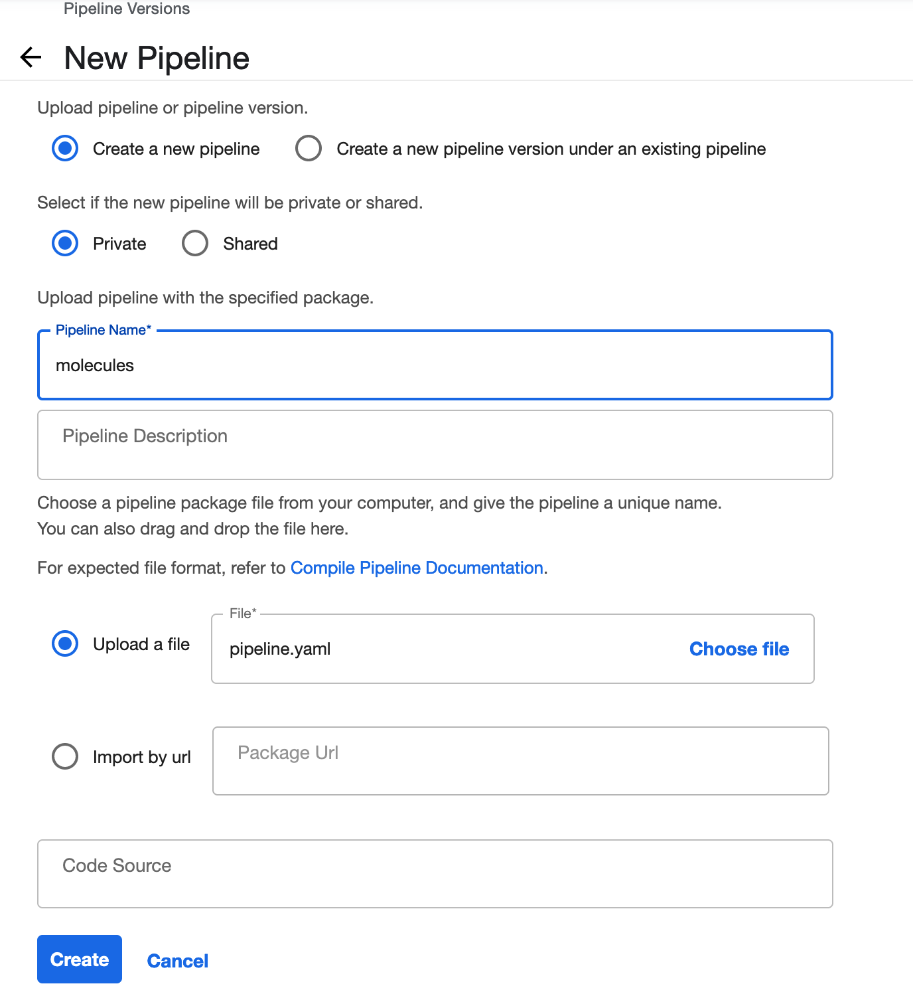

# Molecules pipeline
This pipeline shows how to use container components with a custom container. Custom container for this is 
defined in `images/molecules`. Make sure to build and upload it to a container registry accessible from
you Kubeflow deployment.

## Usage
### Compiling the pipeline
Pipelines are usually compiled in [IR YAML](https://www.kubeflow.org/docs/components/pipelines/v2/compile-a-pipeline/#ir-yaml) 
before being uploaded to Kubeflow.

```shell
COMPONENTS_IMAGE='<some-registry>/kubeflow-examples/chem-util' python pipeline.py
```

### Upload the pipeline
Navigate to *"Pipelines"* in you Kubeflow deployment and click on *"+ Upload pipeline"*. Select the compiled 
`pipeline.yaml`.




### Running the pipeline
#### Dataset
The dataset for this pipeline is in `data/molecules/ames.csv.gz`. Make sure to copy it to your MinIO to 
`minio://kubeflow-examples/data/molecules/ames.csv.zip`.
#### Experiment
You should create an experiment for the runs of your pipeline.

#### Run
You can create runs from the UI. You will have to select a pipeline, version, and experiment. Any potential
commandline parameters are also available in the UI. In this case `n_bits` and `n_trees`.


By clicking on a specific run you can monitor progress and see other details.


You can compare successful runs by selecting at least two runs and then click *"Compare runs"*.


### Model serving
Model serving uses a custom predictors as well as a transformer. We need the transformer to convert 
[SMILES](https://en.wikipedia.org/wiki/Simplified_molecular-input_line-entry_system) representation of molecules to bit 
vectors which is something that model (predictor) can then work with.  
You can find predictor and transformer in [images/molecules](../../images/molecules) folder in `model-serving.py`.
The manifest of InferenceService is in [serving/molecules](../../serving/molecules). The inference service can be 
applied by copy/pasting the manifest into "New Endpoint" window in Kubeflow UI or via commandline:

```shell
kubectl apply -f serving/molecules/model.yaml -n <my-namespace>
```

#### Making predictions
The inference service will become available at an internal and external URL. You can find those in the endpoint url.
You can use those url to make requests:
```python
import requests
payload = {'instances': ["CCCC", "c1cc(O)ccc1"]}
response = requests.post(
    '<protocol>://<endpoint>.<namespace>.svc.cluster.local/v1/models/<model-name>:predict',
    json=payload,
)
print(response.content)
```
